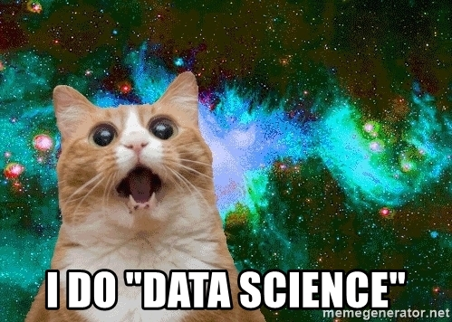

```{r, message = FALSE, warning = FALSE, echo = FALSE}
chooseCRANmirror(graphics = FALSE, ind = 10)
if (!require("pacman")) install.packages("pacman") 
pacman::p_load(ggplot2, knitr)

# Prevents code from getting out of the page
## Works with almost everything except urls and strings.
## Last options hold the position of figures
opts_chunk$set(tidy.opts=list(width.cutoff=50),tidy=TRUE, fig.pos = "h", out.extra = "")
```

# Introduction

This is an example of an R script for the Introduction to RMarkdown workshop for the Share your knowledge week 2023 at Erasmus University.

# Declaring functions

## `fCreateData`

`fCreateData(n)` creates a data frame with `n` observations and `3` groups, where the observations are generated from a normal distribution. Group A observations come from $\mathcal{N}(5,3)$, group B comes from $\mathcal{N}(7,2)$ and group C is generated using $\mathcal{N}(8,11)$.

### Inputs

* `n`: number of rows

### Output

* `data`: a data frame with 2 columns and `n * 3` rows.

```{r, message = FALSE, warning = FALSE, echo = TRUE}
fCreateData <- function(n = 100){
  data <- data.frame(values = c(rnorm(n, 5, 3),
                                rnorm(n, 7, 2),
                                runif(n, 8, 11)),
                     group = c(rep("A", n),
                               rep("B", n),
                               rep("C", n)))
  return(data)
}
```

## `fComputeAverage`

`fComputeAverage(data)` calculates the average of a quantitative variable according to groups defined in another variable.

### Inputs

* `data`: a data frame with 2 columns and `n * 3` rows. First column should be numeric and named `values`, while second column should be categorical and named `group`.

### Output

* `average`: a table with 3 columns where each value is the average of each group in `data`. 

```{r, message = FALSE, warning = FALSE, echo = TRUE}
fComputeAverage <- function(data = data){
  
  if (!is.data.frame(data)){
    stop("Please use a data.frame object!")
  }
  
  average <- tapply(data$values, data$group, mean)
  return(average)
}
```


# Initialization

```{r, message = FALSE, warning = FALSE, echo = TRUE}
n  <- 200
dX <- fCreateData(n)
```

# Main

We first check the first and last observations from `dX`, to see what information is there.

```{r, message = FALSE, warning = FALSE, echo = FALSE}
head_tail <- cbind(head(dX), rep("|", n = 6),tail(dX))
colnames(head_tail) <- c("Value", "Group", "", "Variable", "Group")
kable(head_tail,
      caption = "First and last values of dX")
```

Now we take a look of the average value for each group.

```{r, message = FALSE, warning = FALSE, echo = FALSE}
kable(fComputeAverage(dX),
      caption = "Average values per group from dX")
```

And we take a look on the histogram.

```{r, message = FALSE, warning = FALSE, echo = FALSE}
g1 <- ggplot(dX, aes(x = values, fill = group)) +                       
  geom_histogram(position = "identity", alpha = 0.3, bins = 50) +
  theme_bw() + 
  xlab("Values") + ylab("Frequencies")

g1
```

# Markdown syntax

You can write plain text outside code chunks and Markdown allows for some basic formatting. For example, you can write in **bold**, _italic_ or ~~cross out~~ text. You can also make lists:

1. With the first item
2. With the second item
    a. Add identation for more levels
        i. And more identation for a third level
    * You can also use bullets

Markdown also allows for outside links, [like this one](https://github.com/adam-p/markdown-here/wiki/Markdown-Cheatsheet). Or you can include images such as Figure 1 (if you try to compile yourself, make sure you download the image from [here](https://memegenerator.net/img/instances/56007901/i-do-data-science.jpg) and save as "data_science.jpg" in the same directory as the rmd file, otherwise you will get an error).



Check the other links on the slides for more about Markdown syntax.

# Writing LaTeX equations

We can add LaTeX equations in two different ways: $x = 2 + 1$ or

$$x = 2 + 1$$

## Writing what is in the instructions_report.pdf file

Equations and mathematical symbols can be easily added to a Markdown file. A fraction of two-thirdas can be written as $\frac{2}{3}$. Other expressions are, e.g., $\hat{\lambda} = 1.02$ and $\sqrt{4}$. 

(...)

An $n \times m$ matrix can be shown as

\begin{equation}
  n\mathbb{A}m =
  \begin{pmatrix}
    a_{11} & a_{12} & \ldots & a_{1m}\\
      a_{21} & a_{22} & \ldots & a_{2m}\\
      \vdots & \vdots & \ddots & \vdots \\
        a_{n1} & a_{n2} & \ldots & a_{nm}
  \end{pmatrix}
\end{equation}

You can use [Mathpix Snip](https://mathpix.com/) to crop images, pdf files and other type of files and generate a LaTeX code. There are good tutorials on how to write equations in LaTeX (just be aware that in RMarkdown your possibilities with packages are a bit more limited than in a *.tex document). Some references can be found [here](http://tug.ctan.org/info/short-math-guide/short-math-guide.pdf) or in the report instructions on Canvas.

# Inserting R code

```{r, eval = TRUE, echo = FALSE, warning = FALSE}
# This is the most basic R code chunk
x <- 1+1
x
```

## Adding inline R code

To use R code inline, you need to type `r 3+1`. Besides doing simple math operations, you can call objects that are already saved in the memory. Recall that the value of $x$ is `r x`.

Alternatively, you can use functions, such as `r mean(c(1,2,3,4))`. But for tables, figures and more elaborate code, you have to use a code chunk.

# Having a bibliography file

In case you use references, you can include them in the RMarkdown file in an automatic way. In the same folder as your rmd file you should have a `*.bib` archive, which then is called on the header of your `rmd` document. Specifically, the header says:

```{}
title: "My first Markdown Report"
author: |
  | Instructor: [A. Schmidt](https://sites.google.com/view/aishameriane)
date: "March, 2023"
output:
  pdf_document:
subtitle: Share your knowledge week
editor_options:
  chunk_output_type: inline
urlcolor: blue
linkcolor: red
bibliography: references.bib
```

The bib file contains a single reference, that has a [BibTeX](https://www.economics.utoronto.ca/osborne/latex/BIBTEX.HTM) format. 

```{}
@book{ISL,
  title={An introduction to statistical learning},
  author={James, Gareth and Witten, Daniela and Hastie, Trevor and Tibshirani, Robert},
  volume={112},
  year={2013},
  publisher={Springer}
}
```

The first thing that appear after the bracket is the alias that you use to 'call' the book in your text. In RMarkdown, you need to use the `@` sign, followed by this alias:`[@ISL]` results in [@ISL]. When you call a reference, RMarkdown will automatically add it in the very end of the document. So we recommend to end your file with a title format for references (even if not is being displayed in your code, it will appear after kniting the file).

To get a citation already in BibTeX format, you can search for the book or paper in Google Scholar, then click on the quotes that appear below the reference, and click in BibTeX on the pop-up. This will go to another page with only the code, that you can copy and paste in your `references.bib` file.

If you do not want to use a bibliography, then just don't call any reference in the file and erase in the header the command calling `references.bib`.

# References
